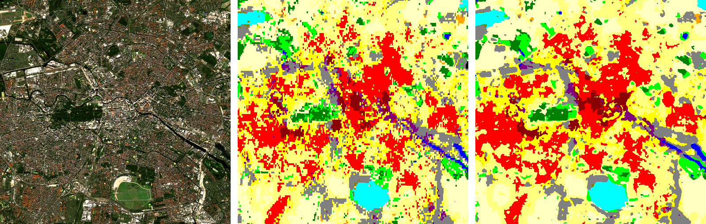
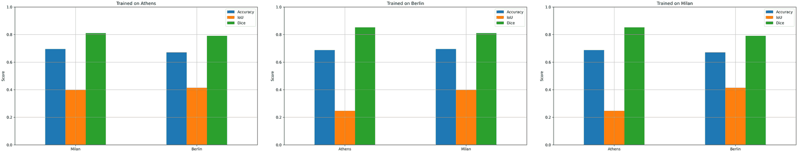
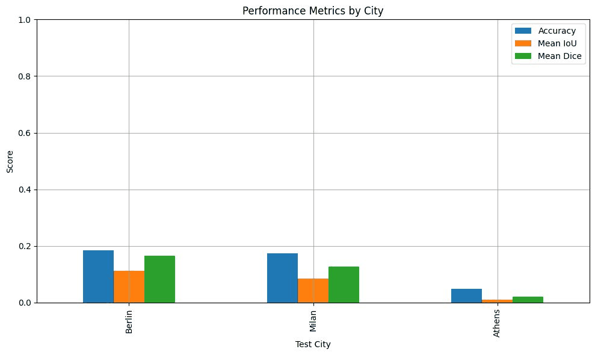
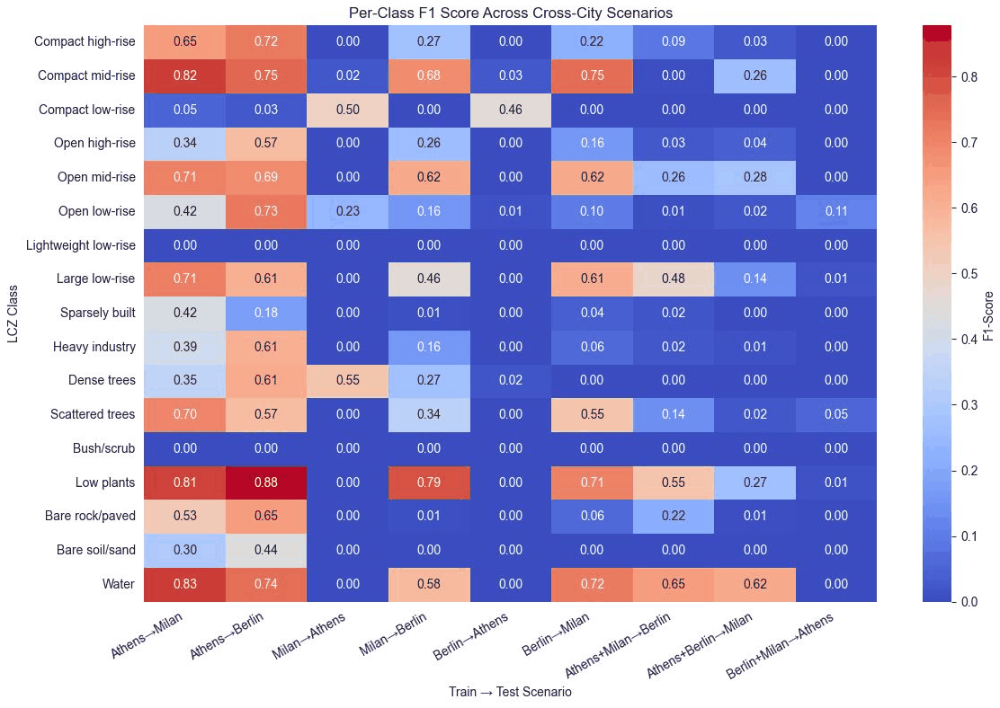
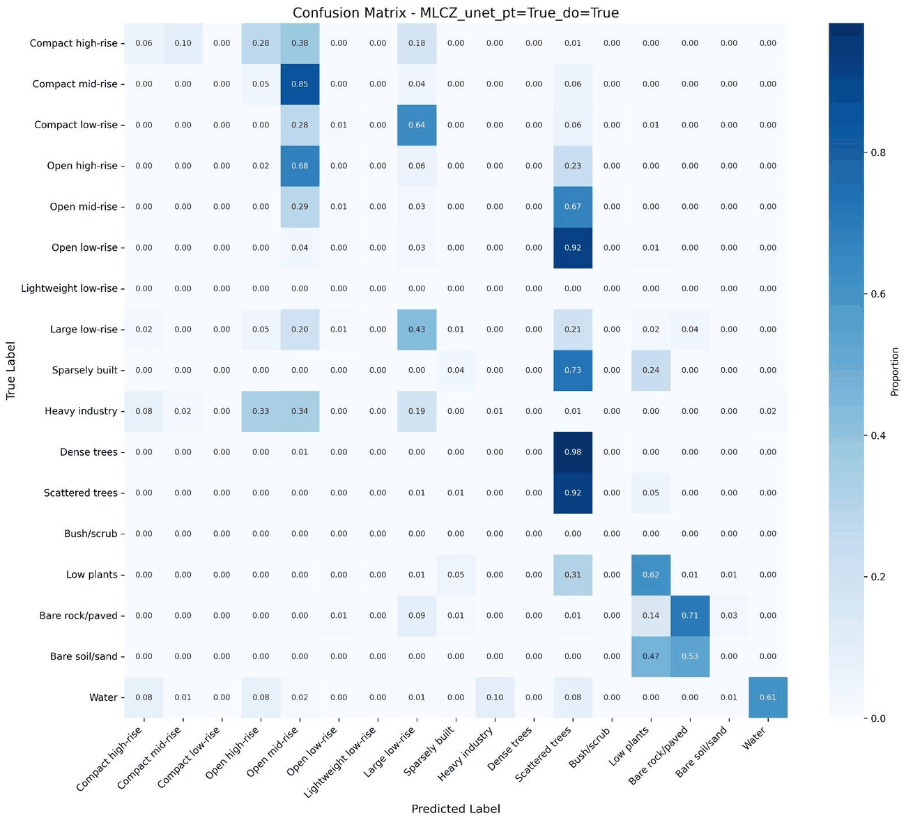
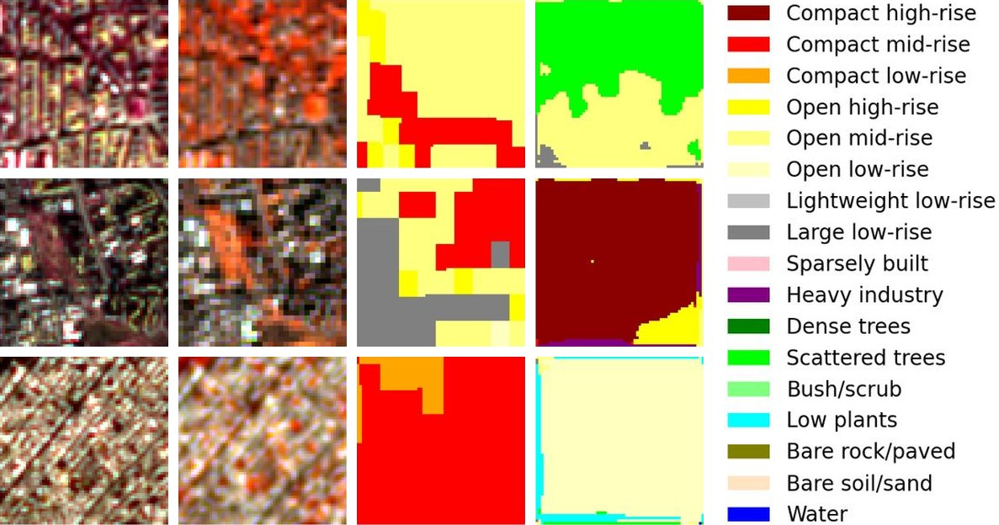

# MLCZ-Pipeline

Semantic segmentation of Local Climate Zones (LCZ) in Athens, Berlin and Milan from Sentinel-2 and PRISMA hyperspectral imagery. A U-Net with a ResNet18 encoder assigns an LCZ class to every 10 m pixel and is trained on maps from the LCZ Generator. The project started as a team project at an Erasmus+ Blended Intensive Programme in Pavia in June 2025.

**Main model:** the U-Net with ImageNet weights, trained for up to 150 epochs on the training patches of all three cities (4900 patches of 64 x 64 pixels, 70 % of each city). Early stopping and the choice of the checkpoint use 1050 validation patches. On the remaining 1052 test patches it reaches an accuracy of 0.735 and a mean IoU of 0.431 over the LCZ classes. Separate cross-city runs train on two cities and test on the third, see [Results](#results).

**Results page with interactive city maps: https://konradjkl.github.io/MLCZ-Pipeline/**

The rasters are not included. [Getting started](#getting-started) explains where to get them and how to run the conversion, training, export and dashboard.



*Berlin, from left to right: Sentinel-2 true color, labels from the LCZ Generator and the prediction of the U-Net, stitched from all patches of the city.*

## About the project

Local Climate Zones (Stewart and Oke, 2012) sort urban and natural landscapes into 17 types by surface cover, structure and thermal properties. Ten are built types (LCZ 1-10, from compact high-rise to heavy industry) and seven are land cover types (LCZ A-G, from dense trees to water). LCZ maps help to find heat-vulnerable areas, plan climate adaptation and zoning, and feed urban microclimate models.

Mapping them from satellite images is not easy. Cities mix buildings, roads and green areas, zone boundaries are often unclear, light and shadows change how buildings look, and there is little ground truth. Sentinel-2 covers large areas with multispectral bands, and PRISMA adds hyperspectral detail that helps to tell materials apart, such as rooftops, pavement and bare soil. This project feeds both into one segmentation model.

### Team and history

This was our team project as Group 2 at the Erasmus+ Blended Intensive Programme (BIP) "Machine Learning for Earth Observation Data Processing and Fusion" in Pavia, June 2025: Sona, Sohane, Pegah, Mahila, Samy and me, Konrad Kloska. I wrote most of the code in this repository; the augmentations came from Samy. The figures under [June 2025 presentation](#june-2025-presentation) are the ones we made for our final presentation.

After the programme I cleaned up and extended the code:

- configuration through `.env` and command-line flags instead of hard-coded paths; W&B logs offline when no key is set
- consistent channel and class counts across the scripts, pinned requirements
- seeded runs: the split, the weights and the augmentations (also across DataLoader workers) use seed 42
- fixes in the data: all Sentinel-2 bands are now scaled to reflectance, see [Current results](#current-results)
- fixes in the evaluation: the test report covers the whole test split, the plots use the right Sentinel-2 bands
- whole-city prediction maps, a Streamlit dashboard and the results page

## Data

| Source | Used by the pipeline | Resolution |
|---|---|---|
| Sentinel-2 | 10 bands: B2, B3, B4, B5, B6, B7, B8, B8A, B11, B12 | 10 m and 20 m bands, all at 10 m in the input raster |
| PRISMA | 234 hyperspectral bands | 30 m, resampled to 10 m |
| LCZ Generator | one LCZ class per pixel, used as labels | 100 m map, provided on the 10 m grid |

For each city, `modules/convert_data.py` checks that the three rasters share CRS, resolution and extent. If they don't, it reprojects all three onto the Sentinel-2 grid (bilinear for the images, nearest neighbour for the labels), cropped to the area that all three cover. It then cuts 64 x 64 pixel patches (640 m) every 32 pixels, so neighbouring patches overlap by half, and skips patches with missing values or without any labelled pixel. Each patch holds 244 channels, the 10 Sentinel-2 bands followed by the 234 PRISMA bands, and a label mask. Sentinel-2 rasters stored as digital numbers (reflectance x 10000, Berlin and Milan here) are scaled to reflectance, so all channels lie roughly between 0 and 1; there is no further normalisation.

Labels: 0 is "no data" and is ignored by the loss and the metrics, 1-10 are LCZ 1-10 and 11-17 are LCZ A-G. LCZ 7 (lightweight low-rise) does not occur in any of the three cities, LCZ C (bush, scrub) only in Athens. A patch contains 4.1 classes on average.

| City | Patches | Train | Validation | Test |
|---|---:|---:|---:|---:|
| Athens | 3456 | 2419 | 518 | 519 |
| Berlin | 1482 | 1037 | 222 | 223 |
| Milan | 2064 | 1444 | 310 | 310 |
| **Total** | **7002** | **4900** | **1050** | **1052** |

With the default `hybrid` split, each city is split 70/15/15 at random, stratified by the most frequent class of each patch (seed 42), so every city appears in every split. `--split_strategy city_based` puts whole cities into the splits (with three cities: Athens for training, Berlin for validation, Milan for testing); `patch_based` splits the patches of all cities together 70/15/15.

### Getting the data

The rasters are not part of the repository. Put one folder per city into `data/` (or `DATA_DIR`, see [Configuration](#configuration)):

```
data/
├── Athens/
│   ├── LCZ_Map.tif     1 band, LCZ labels 0-17
│   ├── PRISMA_30.tif   234 bands, 30 m
│   └── S2.tif          10 bands in the order above
├── Berlin/
└── Milan/
```

The folder name becomes the city name; it must not contain underscores, because the patch keys are split at `_`. The label raster needs "lcz" or "label" in its file name, the PRISMA raster "prisma" and the Sentinel-2 raster "s2" or "sentinel". Sentinel-2 can be stored as reflectance or as digital numbers (reflectance x 10000); the conversion scales the latter. The rasters used here were clipped to the city areas and projected to the local UTM zone beforehand; that step is not part of this repository.

- Sentinel-2: Copernicus Data Space Ecosystem, https://dataspace.copernicus.eu
- PRISMA: PRISMA portal of the Italian Space Agency, https://prisma.asi.it (registration and an ASI license required)
- LCZ maps: LCZ Generator, https://lcz-generator.rub.de

## Model and training

The main model is a U-Net from [segmentation_models_pytorch](https://github.com/qubvel-org/segmentation_models.pytorch) with a ResNet18 encoder, 244 input channels and 18 output classes (15.1 M parameters). With `--pretrained` the encoder starts from ImageNet weights; the library then fills the first convolution by repeating its RGB filters over the 244 channels. For comparison there is `CustomCNN` in `modules/model.py`, a small U-Net style network with two pooling levels and optional dropout before the output layer.

The main model, the one on the results page, is the U-Net with ImageNet weights trained with the default hybrid split:

| Split | Patches | Athens / Berlin / Milan | Used for |
|---|---:|---|---|
| Training | 4900 | 2419 / 1037 / 1444 | fitting the weights |
| Validation | 1050 | 518 / 222 / 310 | early stopping and choosing the checkpoint |
| Test | 1052 | 519 / 223 / 310 | the reported scores |

The loss is `0.7 * cross-entropy + 0.3 * focal loss` (Lin et al., 2017) with gamma 2, ignoring label 0. The focal term down-weights pixels the model already classifies with confidence, which gives the rare classes more weight. `--class_weights` adds inverse frequency weights to the cross-entropy.

| Setting | Value |
|---|---|
| Epochs | 50 at most (default, as in the presentation); the main model uses `--epochs 150` and stopped early after 132, with the best checkpoint from epoch 117 |
| Batch size | 32 |
| Optimizer | AdamW, learning rate 0.0005, weight decay 0.0001 |
| Learning rate schedule | OneCycleLR per step (30 % warm-up, cosine decay) for up to 50 epochs, CosineAnnealingLR per epoch for longer runs such as the main model |
| Early stopping | validation mean IoU, patience 15 epochs |
| Checkpoint | best validation mean IoU, used for testing |
| Gradient clipping | norm 1.0 |
| Seed | 42 |

These are the defaults of `modules/experiments.py` and the values used for the presentation. The main model only raises the number of epochs, which also switches the schedule to CosineAnnealingLR. Accuracy, IoU and F1 are logged to Weights & Biases after every epoch, all ignoring label 0.

Augmentations, applied to the training patches only, each with probability 0.5:

- horizontal flip, vertical flip, rotation by a multiple of 90 degrees
- shift, scale and rotation (up to 6.25 % shift, 10 % scale, 45 degrees); pixels that rotate in from outside get label 0 and are ignored
- brightness and contrast change of up to 20 % (image only)

`seed_everything(42, workers=True)` seeds PyTorch and NumPy, the augmentations draw from their own seeded generator, and every DataLoader worker gets its own stream derived from the seed. The Trainer runs with `deterministic="warn"`, so PyTorch uses deterministic algorithms where they exist and warns where they don't.

`python main.py --train` runs four experiments, each in its own process:

| Run | `--arch_name` | ImageNet encoder | Dropout |
|---|---|---|---|
| U-Net, as in the presentation | `unet` | yes | no |
| U-Net from scratch | `unet` | no | no |
| CustomCNN with dropout | `CustomCNN` | no | yes |
| CustomCNN | `CustomCNN` | no | no |

Single runs, including the single-city and cross-city setups of the presentation, go through `modules/experiments.py` directly (see [Train](#2-train)).

## Results

### Current results

The main model (see [Model and training](#model-and-training)) was tested on the 1052 test patches of all three cities. The [results page](https://konradjkl.github.io/MLCZ-Pipeline/) shows its stitched maps next to the labels, with scores per split and per class.

| Test patches | Accuracy | Mean IoU |
|---|---:|---:|
| Athens (519) | 0.784 | 0.371 |
| Berlin (223) | 0.661 | 0.358 |
| Milan (310) | 0.707 | 0.332 |
| All three cities (1052) | 0.735 | 0.431 |

The mean IoU over all cities is higher than in each city: within one city some classes are rare or only predicted by mistake and get an IoU close to 0, while over all cities every class is scored on all of its pixels. The best classes reach an IoU between 0.59 and 0.67 (compact low-rise, low plants, open low-rise, compact mid-rise, dense trees, water, large low-rise). The hardest are bare rock or paved (0.16), bare soil (0.25), heavy industry (0.25) and open high-rise (0.28); bush/scrub, with only 758 test pixels in Athens, is never predicted correctly. Patches overlap by half and are assigned to the splits at random, so test patches share pixels with training patches and these scores are optimistic.

The harder test is a city the model has never seen. The cross-city runs train on two cities for up to 50 epochs and test on the third:

| Test city | Trained on | Accuracy June 2025 | Accuracy now | Mean IoU June 2025 | Mean IoU now |
|---|---|---:|---:|---:|---:|
| Berlin | Athens, Milan | 0.185 | 0.233 | 0.107 | 0.093 |
| Milan | Athens, Berlin | 0.157 | 0.352 | 0.071 | 0.095 |
| Athens | Berlin, Milan | 0.156 | 0.120 | 0.026 | 0.048 |

The June 2025 columns are our W&B runs from the course, all three made with the same code. They differ from the new runs in more than the data fixes: batch size 96 instead of 32, weight decay 0.01 instead of 0.0001, class weights in the loss and no seed. So the table shows where things stand, not what each fix did. The accuracy is higher on Milan and Berlin and lower on Athens, the mean IoU is higher on Milan and Athens and a little lower on Berlin, and it is below 0.1 everywhere. Transfer to a city without labels is still the open problem. The presentation chart below was made with evaluation code that is no longer in the repository, so its values differ slightly from these runs.

What I found after the programme:

- Check the value range of every input in every city. The Sentinel-2 rasters of Berlin and Milan held digital numbers while the one of Athens held reflectance, and the brightness augmentation clipped the digital numbers to 1, which wiped out their Sentinel-2 bands in about half of the training patches. Nothing crashed; the model simply trained on broken inputs.
- The evaluation had bugs of its own: the test report logged zeros as soon as a pixel was predicted as no data, it only covered the first 20 test batches, and the plots used the wrong Sentinel-2 bands.
- The main model profits from longer training: with `--epochs 150`, which also switches from OneCycleLR to cosine annealing, the test accuracy rose from 0.706 to 0.735 and the mean IoU from 0.383 to 0.431.
- Next I would bring the rasters of all cities to the same statistics and add more cities to help the transfer, and test the main model on areas that are spatially separated from its training patches, so that its scores are no longer optimistic.

### June 2025 presentation

We tested two setups: single-city (train on one city, test on the other two) and cross-city (train on two cities, test on the third, as for a city without labels).



*Single-city training: accuracy, IoU and Dice on the two other cities, for models trained on Athens, Berlin and Milan.*



*Cross-city training: accuracy, mean IoU and mean Dice on the city left out of training.*

Transfer to an unseen city was the weak point. The chart shows an accuracy below 0.2 for every test city and about 0.05 for Athens; the W&B test values of our June runs are in the table under [Current results](#current-results).



*F1 per class for all nine train/test scenarios.*

The per-class F1 shows where transfer worked: trained on Athens, the model reached 0.88 for low plants in Berlin and 0.83 for water in Milan. Tested on Athens, most classes dropped to 0 whichever cities the model was trained on. Lightweight low-rise and bush/scrub are 0 everywhere.



*Row-normalised confusion matrix for Berlin, model trained on Athens and Milan.*

In Berlin most errors fall into two classes: open low-rise and dense trees are predicted as scattered trees (0.92 and 0.98 of their pixels), compact mid-rise as open mid-rise (0.85).



*Test patches from the cross-city runs. Rows: Berlin (trained on Athens and Milan), Milan (trained on Berlin and Athens), Athens (trained on Milan and Berlin). Columns: Sentinel-2 composites B5/B4/B3 and B8A/B5/B4, ground truth, prediction.*

Notes on these figures:

- Two data problems affected the June 2025 runs: the Sentinel-2 values of Berlin and Milan were digital numbers while those of Athens were reflectance, and the brightness augmentation clipped the digital numbers to 1, which wiped out the Sentinel-2 bands of about half of the Berlin and Milan training patches. Both are fixed now, see [Current results](#current-results).
- In the single-city chart the bars for a test city are the same in both panels in which it appears, whichever city the model was trained on, while the per-class F1 above differs by training city. Read that chart as indicative only.
- The Dice scores came from evaluation code that is no longer in the repository, and they do not fit the IoU values next to them (with the same averaging, a mean IoU of 0.25 allows a mean Dice of at most 0.4). The current code does not compute Dice.

## Getting started

### Requirements

- Python 3.12 (tested on Windows 11)
- an NVIDIA GPU for training (the project used CUDA 12.8); training also runs on the CPU, but slowly, while conversion, export, dashboard and tests are fine on the CPU
- about 1.5 GB for the rasters and 40 GB of free disk space for the converted patches (see [Convert](#1-convert-the-rasters))

### Setup

Windows, PowerShell:

```powershell
git clone https://github.com/KonradJKl/MLCZ-Pipeline.git
cd MLCZ-Pipeline
py -3.12 -m venv .venv
.venv\Scripts\Activate.ps1
python -m pip install --upgrade pip
# PyTorch with CUDA 12.8; for the CPU build use https://download.pytorch.org/whl/cpu
pip install torch==2.7.0 torchvision==0.22.0 --index-url https://download.pytorch.org/whl/cu128
pip install -r requirements.txt
Copy-Item .env.example .env
```

If PowerShell refuses to run `Activate.ps1`, allow local scripts for your user with `Set-ExecutionPolicy -Scope CurrentUser RemoteSigned`.

On Linux and macOS use `python3.12 -m venv .venv`, `source .venv/bin/activate` and `cp .env.example .env`; the rest is the same. On macOS install `torch==2.7.0` and `torchvision==0.22.0` from PyPI without the index URL (CPU only).

The commands below are run from the repo root with the environment activated. On Linux and macOS replace the backtick at the end of a line with a backslash.

### Configuration

`.env` (copied from `.env.example`) holds:

| Key | Default | Meaning |
|---|---|---|
| `WANDB_API_KEY` | empty | Weights & Biases key; without it runs are logged offline to `logs/wandb` and can be uploaded later with `wandb sync` |
| `DATA_DIR` | `data` | city folders with the rasters |
| `OUTPUT_DIR` | `processed` | converted patches (`MLCZ.lmdb`) and metadata (`MLCZ.parquet`) |
| `LOGS_DIR` | `logs` | W&B runs, checkpoints and plots |
| `DOCS_DIR` | `docs` | target of `--export` |

Relative paths are resolved from the repo root. A `wandb login` alone does not switch to online logging; put the key into `.env` or set `WANDB_MODE=online`.

### 1. Convert the rasters

```powershell
python main.py --convert
```

This aligns the rasters, cuts the patches, splits them and writes `processed/MLCZ.lmdb` and `processed/MLCZ.parquet`. If both already exist the step is skipped; delete them to convert again, for example with another split. Options: `--split_strategy` (`hybrid`, `city_based`, `patch_based`; default `hybrid`), `--stratify_by` (`city`, `labels`, `mixed`, `none`; default `mixed`) and `--map_size`.

Each patch takes about 4 MB (244 x 64 x 64 float32 values), about 28 GB for all three cities. LMDB needs a maximum database size up front, `--map_size`, which defaults to 4e10 bytes (40 GB). On Windows the file is created at that full size right away, so the disk needs 40 GB free; on Linux it grows as data is written. If the size is too small the conversion stops with an `lmdb.MapFullError`.

### 2. Train

```powershell
python main.py --train              # the four runs above, 50 epochs each
python main.py --train --epochs 1   # quick check that everything runs
```

Each run trains, tests its best checkpoint and saves plots. If a run fails, the others still run and `main.py` lists the failed ones at the end.

A single run, here the main model. It takes about 1 hour 45 minutes on an RTX 3070; without `--epochs 150` it is the 50-epoch run of the presentation:

```powershell
python modules/experiments.py --arch_name unet --pretrained --epochs 150 `
    --lmdb_path processed/MLCZ.lmdb --metadata_parquet_path processed/MLCZ.parquet
```

Other options include `--epochs`, `--batch_size`, `--learning_rate`, `--weight_decay`, `--seed`, `--num_workers`, `--dropout`, `--class_weights` and `--logging_dir` (default `logs/`, it does not read `LOGS_DIR`).

Cross-city, trained on Athens and Milan and tested on Berlin:

```powershell
python modules/experiments.py --arch_name unet --pretrained `
    --lmdb_path processed/MLCZ.lmdb --metadata_parquet_path processed/MLCZ.parquet `
    --train_cities Athens Milan --val_cities Athens Milan --test_cities Berlin
```

The city filters apply within the splits of the conversion, so with the hybrid split this run trains on the training patches of Athens and Milan and is tested on the 223 test patches of Berlin. For single-city training use for example `--train_cities Berlin --val_cities Berlin --test_cities Athens Milan`, which trains on the 1037 training patches of Berlin and tests on the 829 test patches of Athens and Milan. `--label_filter` and `--min_label_diversity` select patches by their most frequent class and their number of classes.

### 3. Export the results page

```powershell
python main.py --export --checkpoint logs/MLCZ-Pipeline-Server/<run id>/checkpoints/<file>.ckpt
```

This predicts every patch of every city with the checkpoint, stitches the city maps (where patches overlap, the class with the highest summed probability wins) and writes `docs/results.json` and the images in `docs/maps/`. The page itself (`docs/index.html`, `style.css`, `viewer.js`) reads them.

Always pass `--checkpoint`. Without it the newest checkpoint below `logs/` is used, and after `--train` that is the last of the four runs (CustomCNN without dropout). The pretrained U-Net runs first, so its run folder is the oldest of the four.

To view the page locally, serve the folder instead of opening the file directly:

```powershell
python -m http.server 8000 --directory docs
```

and open http://localhost:8000. To publish the page, commit `docs/results.json` and `docs/maps/`, then in the repository settings under Pages choose "Deploy from a branch", branch `master`, folder `/docs`.

### 4. Dashboard

```powershell
streamlit run app.py
```

The dashboard opens at http://localhost:8501. Choose a checkpoint from `logs/`, a city and a view: the whole city map with scores per split and per class, or single patches filtered by split and main class. The first prediction of a city takes a while and is cached afterwards. It needs the converted data and at least one checkpoint.

### 5. Tests

```powershell
python -m tests.test_city_maps
```

The tests check the stitching, the metrics (against torchmetrics) and loading checkpoints on a small synthetic dataset, so they don't need the real data.

### Running in PyCharm

1. Open the repo folder and set the project interpreter to `.venv\Scripts\python.exe` (Settings > Project: MLCZ-Pipeline > Python Interpreter).
2. Create run configurations with the repo root as working directory:
   - script `main.py`, parameters `--convert`, `--train` or `--export --checkpoint <path>`
   - module `streamlit`, parameters `run app.py` (dashboard)
   - module `tests.test_city_maps` (tests)

`modules/config.py` reads `.env` itself, so the run configurations need no environment variables.

### Outputs

| Path | Written by | Content |
|---|---|---|
| `processed/MLCZ.lmdb` | `--convert` | patches and label masks |
| `processed/MLCZ.parquet` | `--convert` | one row per patch: city, split, position, most frequent class, number of classes |
| `logs/MLCZ-Pipeline-Server/<run id>/checkpoints/` | training | best checkpoint of each run |
| `logs/wandb/` | training | W&B run files |
| `logs/visualizations/` | training | confusion matrix, sample predictions, classification report and metrics JSON of each run |
| `docs/results.json`, `docs/maps/` | `--export` | scores and maps for the results page |

`data/`, `processed/`, `logs/` and `.env` are ignored by git.

## Project structure

```
MLCZ-Pipeline/
├── main.py                 --convert, --train and --export
├── app.py                  Streamlit dashboard
├── modules/
│   ├── config.py           paths from .env
│   ├── convert_data.py     raster alignment, patches, splits, LMDB and parquet
│   ├── MLCZ.py             Dataset and LightningDataModule with city and label filters
│   ├── model.py            U-Net (ResNet18 encoder) and CustomCNN
│   ├── base.py             LightningModule: loss, optimizer, schedule, metrics
│   ├── experiments.py      one training run with test and plots
│   ├── visualization.py    confusion matrices, sample predictions, reports
│   ├── city_maps.py        predicts and stitches whole cities, scores; used by app.py and the export
│   └── static_page.py      writes results.json and the maps for the results page
├── tests/
│   └── test_city_maps.py   tests for stitching, metrics and checkpoint loading
├── docs/                   results page for GitHub Pages; img/ holds the presentation figures
├── .streamlit/config.toml  keeps the dashboard on localhost
├── .env.example
└── requirements.txt        pinned versions and install notes
```

## Acknowledgements and data attribution

Thanks to the organisers and lecturers of the BIP in Pavia and to my team: Sona, Sohane, Pegah, Mahila and Samy.

- Contains modified Copernicus Sentinel data 2025.
- Project carried out using ORIGINAL PRISMA Products, © Italian Space Agency (ASI), delivered under an ASI license to use. PRISMA data are not included in this repository, and the results page shows no PRISMA imagery, only Sentinel-2 images and maps derived from the model.
- LCZ labels from the LCZ Generator: Demuzere, M., Kittner, J., Bechtel, B. (2021). LCZ Generator: A Web Application to Create Local Climate Zone Maps. Frontiers in Environmental Science 9:637455. https://doi.org/10.3389/fenvs.2021.637455

## References

- Ronneberger, O., Fischer, P., Brox, T. (2015). U-Net: Convolutional Networks for Biomedical Image Segmentation. MICCAI 2015, LNCS 9351, 234-241. https://doi.org/10.1007/978-3-319-24574-4_28
- He, K., Zhang, X., Ren, S., Sun, J. (2016). Deep Residual Learning for Image Recognition. CVPR 2016, 770-778.
- Lin, T.-Y., Goyal, P., Girshick, R., He, K., Dollár, P. (2017). Focal Loss for Dense Object Detection. ICCV 2017, 2980-2988.
- Stewart, I. D., Oke, T. R. (2012). Local Climate Zones for Urban Temperature Studies. Bulletin of the American Meteorological Society 93(12), 1879-1900. https://doi.org/10.1175/BAMS-D-11-00019.1
- Demuzere, M., Kittner, J., Bechtel, B. (2021). LCZ Generator: A Web Application to Create Local Climate Zone Maps. Frontiers in Environmental Science 9:637455. https://doi.org/10.3389/fenvs.2021.637455
- Iakubovskii, P. (2019). Segmentation Models Pytorch. https://github.com/qubvel-org/segmentation_models.pytorch
